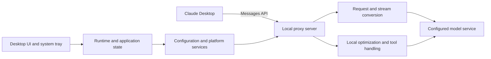
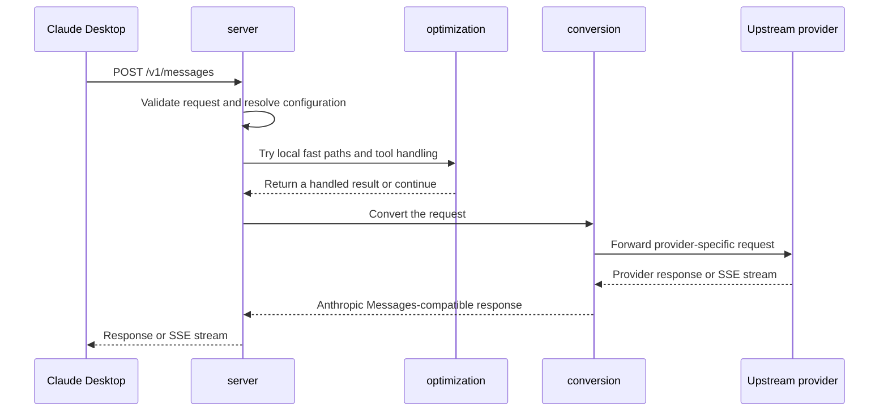

# FreeClaudeDesktop Architecture

This document describes FreeClaudeDesktop's main components, data flow, and maintenance boundaries. For installation and everyday usage, see [README.md](README.md).

## Architecture and data flow

FreeClaudeDesktop is a cross-platform Rust desktop application. It provides a graphical interface and system-tray controls while running a local HTTP proxy that lets Claude Desktop communicate with a configured upstream model service.

The local proxy normally listens on port `3000`. A commonly used LiteLLM upstream listens on port `4000`. Both values are user configuration, not business-logic constants.

## Module responsibilities

| Area | Primary location | Responsibility |
| --- | --- | --- |
| Startup composition | `src/main.rs` | Initializes logging, loads startup configuration, starts local services, and launches the Iced desktop UI. |
| Runtime coordination | `src/runtime/` | Manages application state, background tasks, events, and UI commands. |
| User interface | `src/ui/` | Contains Iced views, styles, interactive controls, and system-tray presentation. |
| HTTP proxy | `src/server/` | Exposes local routes, validates requests, forwards traffic, and streams responses. |
| Protocol conversion | `src/conversion/` | Converts data and SSE streams between Anthropic Messages, OpenAI-compatible formats, and provider-specific formats. |
| Optimization | `src/optimization/` | Handles local fast paths, web content, and tool-related optimizations. |
| Platform integration | `src/platform/` | Encapsulates Windows, Linux, and macOS paths, configuration locations, and Claude Desktop integration. |
| Core configuration and models | `src/core/`, `src/models/` | Defines persisted configuration, shared domain types, and validation rules. |
| MCP support | `src/mcp/` | Manages MCP configuration and related integration behavior. |

## Startup sequence

1. `src/main.rs` initializes logging and application-level configuration.
2. `platform` and `core` resolve platform paths and load the proxy configuration.
3. `server` starts the local HTTP service.
4. `runtime` starts the Iced UI and system-tray integration, then connects UI actions to runtime events.
5. Background tasks observe configuration changes and keep the local proxy aligned with the active settings.

## Message conversion flow

Claude Desktop sends Messages API requests to the local `/v1/messages` endpoint. The `server` layer validates the request and resolves the active proxy configuration. The `optimization` layer can satisfy eligible local work first. Otherwise, `conversion` transforms the request for the upstream provider and translates its response or stream back into the Anthropic Messages format expected by Claude Desktop.

The proxy operates independently from the UI. HTTP routing belongs in `server`; UI state must not be required to process requests. This keeps the service easier to test and avoids coupling Axum request handling to Iced state.

## Configuration and platform boundaries

Configuration includes upstream URLs, credentials, model settings, and local proxy options. Sensitive values must never be written to logs, documentation examples, issue templates, or release notes.

Claude Desktop configuration and installation paths differ across Windows, Linux, and macOS. Keep those differences inside `platform` whenever possible. Business logic, conversion, and UI code should use platform-neutral interfaces instead of scattered operating-system conditionals.

## Maintenance guidelines

- Keep blocking or long-running I/O out of UI handlers; dispatch it through `runtime`.
- Keep `server` responsible for HTTP behavior and `conversion` responsible for protocol translation.
- Preserve streaming semantics when converting upstream responses; do not buffer a stream unless the operation explicitly requires it.
- Keep platform-specific paths and integration code out of shared business logic.
- Before changing proxy behavior or configuration loading, run at least `cargo check --locked`; run `cargo test` when the affected tests are available.

## Related documents

- [English README](README.md)
- [繁體中文 README](README_zh.md)
- [Release workflow](.github/workflows/release.yml)
