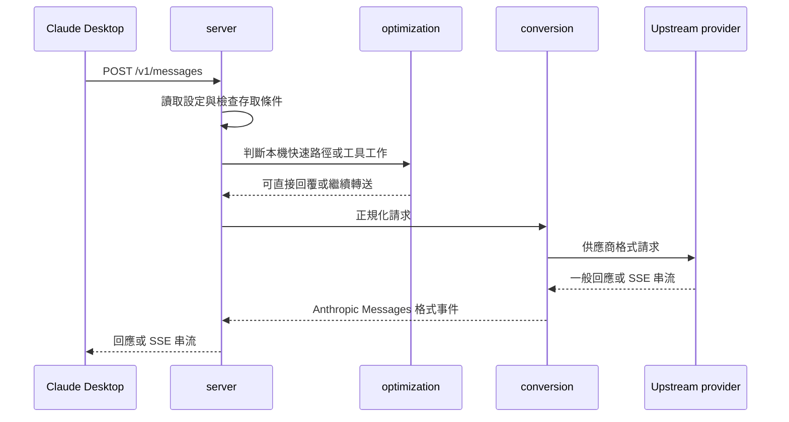

# FreeClaudeDesktop 架構

本文件說明 FreeClaudeDesktop 的主要元件、資料流與維護邊界。安裝與使用方式請見 [README](README.md)。

## Architecture and data flow

FreeClaudeDesktop 是以 Rust 實作的跨平台桌面應用程式。它提供圖形介面與系統匣控制，並在本機啟動 HTTP Proxy，讓 Claude Desktop 的 Anthropic Messages 請求能依設定轉送至相容的模型服務。

預設情況下，本機 Proxy 使用連接埠 `3000`；專案慣用的 LiteLLM 上游服務使用連接埠 `4000`。兩者都應視使用者設定而定，不應在業務邏輯中寫死。

## 模組責任

| 區域 | 主要位置 | 責任 |
| --- | --- | --- |
| 啟動組裝 | `src/main.rs` | 初始化記錄、讀取啟動設定、啟動本機服務與 Iced 桌面介面。 |
| 執行期協調 | `src/runtime/` | 管理應用程式狀態、背景工作、事件與 UI 命令。 |
| 使用者介面 | `src/ui/` | Iced 視圖、樣式、互動元件與系統匣呈現。 |
| HTTP Proxy | `src/server/` | 提供本機路由、驗證請求、轉送與串流回應。 |
| 協定轉換 | `src/conversion/` | 在 Anthropic Messages、OpenAI 相容格式與供應商格式之間轉換資料及 SSE 串流。 |
| 最佳化 | `src/optimization/` | 處理可在本機完成的快速路徑、網頁內容與工具相關最佳化。 |
| 平台服務 | `src/platform/` | 封裝 Windows、Linux、macOS 的路徑、設定檔、憑證與 Claude Desktop 整合差異。 |
| 核心模型 | `src/core/`、`src/models/` | 定義設定、模型、錯誤及跨模組共用的領域型別。 |
| MCP 支援 | `src/mcp/` | 管理 MCP 設定與應用程式需要的工具整合。 |

## 啟動與生命週期

1. `src/main.rs` 建立記錄與應用程式執行環境。
2. `platform` 與 `core` 載入目前設定檔、Proxy 設定及必要的憑證資訊。
3. `server` 在背景啟動本機 HTTP 服務。
4. `runtime` 啟動 Iced 視窗與系統匣，將使用者操作轉為背景命令。
5. 應用程式結束時，執行期工作與本機服務應一併停止，避免留下孤立的 Proxy。

## Message conversion flow

典型請求由 Claude Desktop 對本機 Proxy 的 `/v1/messages` 發出。`server` 讀取設定並檢查 Proxy 的存取條件，`conversion` 將資料正規化為目標上游所需格式；需要時由 `optimization` 處理本機快速路徑或工具工作。上游回應會被轉回 Claude Desktop 可理解的格式，串流回應則維持 SSE 事件順序。

本機路由也包含首頁、模型清單與啟動器控制等端點。新增路由時，應將 HTTP 細節留在 `server`，避免讓 UI 或平台模組直接依賴 Axum 型別。

## 設定與平台邊界

設定檔、服務 URL、選用模型與認證資訊屬於使用者環境資料。所有檔案位置、系統憑證存取與 Claude Desktop 偵測都應透過 `platform` 集中處理；其他模組只依賴穩定的設定與服務介面。

這個邊界讓 Windows、Linux 與 macOS 的差異不會散落於 Proxy、轉換器或 UI 邏輯。新增平台行為時，優先在 `platform` 建立小型抽象，再由呼叫端使用共同介面。

## 維護原則

- UI 只負責呈現與傳遞使用者意圖；長時間或 I/O 工作交給 `runtime`。
- `server` 負責 HTTP 邊界，`conversion` 負責協定語意；不要把供應商格式判斷散落在路由處理器中。
- 新增供應商時，先補齊請求、回應與串流轉換，再將其接到設定選項。
- 新增平台差異時，避免在核心邏輯加入 Windows-only、Linux-only 或 macOS-only 分支。
- 每次改動 Proxy、轉換或設定後，至少執行 `cargo check --locked`；涉及行為時再執行 `cargo test`。

## 相關文件

- [專案說明與建置方式](README.md)
- [繁體中文說明](README_zh.md)
- [Release 流程](.github/workflows/release.yml)
