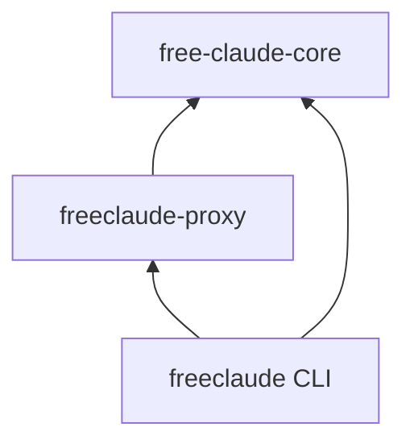
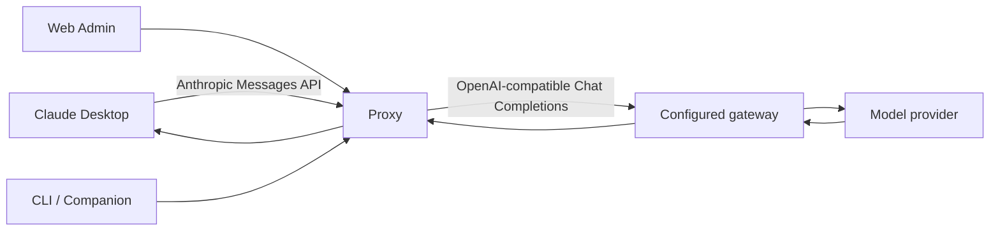
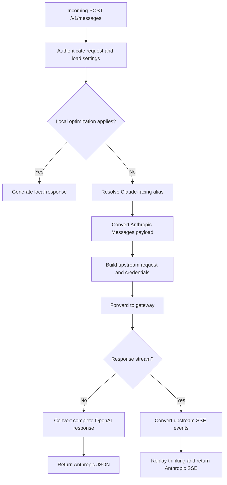
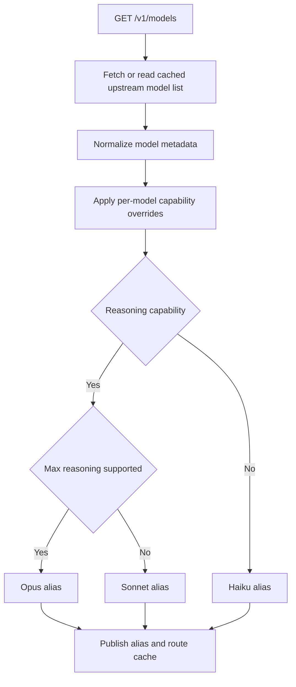
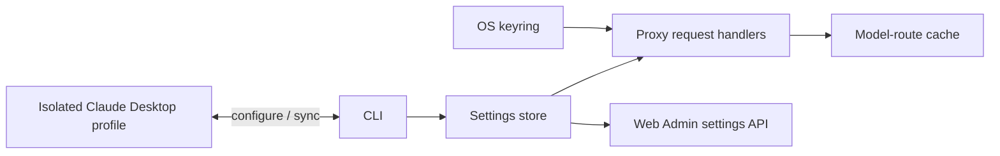

# Architecture

This document describes the internal structure and execution paths of FreeClaudeDesktop. For installation, operation, supported platforms, and security guidance, see [README.md](README.md).

## Crate boundaries

| Crate | Internal responsibility |
| --- | --- |
| `free-claude-core` (`core/`) | Shared schemas, persistent settings, model discovery and routing, request/response conversion, and launcher integration. |
| `freeclaude-proxy` (`proxy/`) | Axum routes, authentication, gateway forwarding, SSE conversion, Web Admin, and companion WebSocket handling. |
| `freeclaude` (`cli/`) | Commands that coordinate installation, process lifecycle, profile configuration, autostart, update, and removal. |

Dependencies flow inward: the CLI and proxy depend on `free-claude-core`; the core crate is independent of the HTTP server and command-line interface.

## Runtime topology

The proxy is the protocol boundary. It accepts Claude-compatible requests, while the gateway adapter sends OpenAI-compatible requests upstream. The companion connection lets the Web Admin coordinate with the host-side CLI process without putting host-control logic inside the proxy container.

## Message execution flow

## Model discovery and routing

An alias is stable for the returned model-list position and uses a bracketed index, such as `claude-opus-5[0]`. A 1M-context capability is represented by `supports1m: true`; the model ID and display label remain clean. `prefer1m: true` makes the 1M variant the default picker selection when that entry is first, and has no effect without `supports1m`. Alias selection is determined by reasoning support: `max` maps to Opus, other supported reasoning levels map to Sonnet, and models without reasoning support map to Haiku.

During request conversion, Claude `thinking.budget_tokens` is translated to a supported `reasoning_effort` level before the upstream request is sent. In response conversion, upstream reasoning is represented either as native Claude thinking blocks or as inline `<antThinking>` text, according to `reasoning_replay_mode`.

## State ownership

- The settings store owns non-secret proxy configuration and model capability overrides.
- The operating-system keyring owns gateway credentials; settings APIs do not return them.
- The CLI owns lifecycle and profile synchronization. The proxy owns request-time model cache state.
