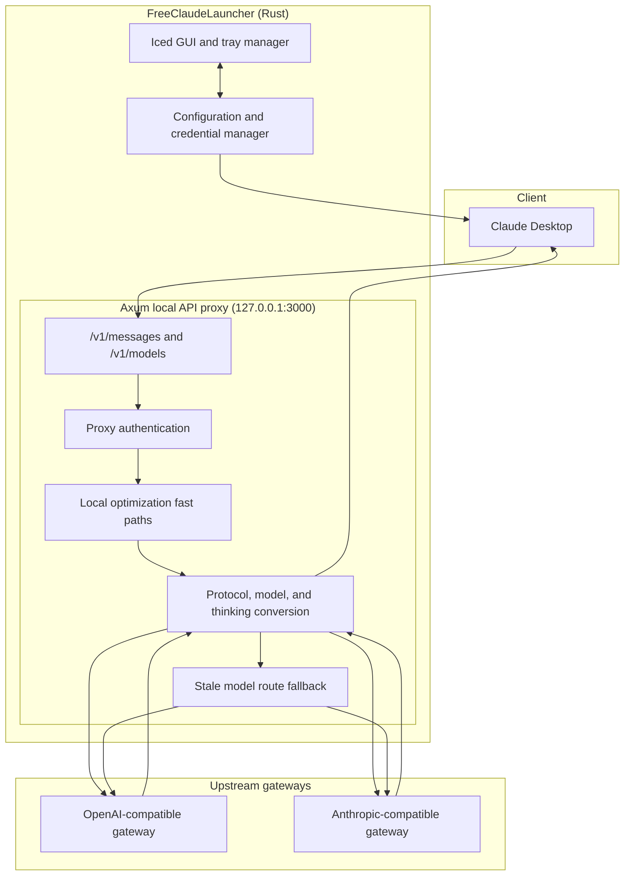

# FreeClaudeLauncher

**FreeClaudeLauncher** is a cross-platform desktop launcher and local API proxy for [Claude Desktop](https://claude.ai/download), built for Windows, macOS, and Linux.

It connects Claude Desktop to OpenAI-compatible or Anthropic-compatible upstream gateways such as One API, LiteLLM, DeepSeek, Ollama, and vLLM.

The project was inspired by [Alishahryar1/free-claude-code](https://github.com/Alishahryar1/free-claude-code), especially its provider-backed local proxy, model-tier routing, and approachable configuration experience. FreeClaudeLauncher is an independent Rust implementation focused on Claude Desktop, native desktop configuration, and isolated profile management; it is not a fork of free-claude-code.

**English** | [繁體中文](README_zh.md)

---

## Architecture and data flow



### Message conversion flow

```mermaid
sequenceDiagram
    autonumber
    participant CD as Claude Desktop
    participant P as Local proxy
    participant OPT as Fast-path optimizer
    participant CONV as Request/response converter
    participant GW as Upstream gateway

    CD->>P: POST /v1/messages (Anthropic format)
    P->>P: Validate local proxy token
    P->>OPT: Detect quota, title, suggestion, and probe requests
    alt Local fast path
        OPT-->>CD: Return local response
    else Normal model request
        OPT->>CONV: Convert request and resolve model alias
        CONV->>GW: POST /v1/chat/completions or /v1/messages
        alt Successful JSON or SSE response
            GW-->>CONV: Response or reasoning_content stream
            CONV-->>CD: Anthropic response or thinking events
        else Stale or unavailable model
            GW-->>CONV: Model error
            CONV->>GW: Retry with a refreshed/fallback route
            GW-->>CONV: Successful response
            CONV-->>CD: Anthropic response
        end
    end
```

---

## Features

### Local API proxy

- Serves Claude Desktop-compatible `/v1/messages` and `/v1/models` endpoints.
- Converts requests, responses, tool calls, and SSE streams between Anthropic Messages and OpenAI Chat Completions formats.
- Supports both OpenAI-compatible and Anthropic-compatible upstream transports.
- Retries stale or deprecated model routes when the gateway reports a model change.

### Model discovery and routing

- Discovers models from the upstream `/v1/models` endpoint and generates unique Claude-compatible aliases.
- Keeps the Claude Desktop configuration and model discovery IDs synchronized.
- Exposes 1M context capability through `supports1m` without appending a synthetic `[1m]` suffix to model IDs.
- Provides a per-model **Show** toggle in the GUI. Hidden models are removed from Claude Desktop configuration, discovery output, routes, and reasoning metadata, while remaining available in the Launcher for later re-enabling.
- Supports explicit default, Opus, Sonnet, and Haiku route overrides.

### Thinking and reasoning

- Converts Claude `thinking.budget_tokens` into upstream `reasoning_effort` levels.
- Reads LiteLLM `model_info.supports_reasoning_effort` and `reasoning_effort_levels` metadata.
- Allows per-model reasoning limits: `none`, `low`, `medium`, `high`, or `max`.
- Clamps requested effort to the nearest level supported by the selected model.
- Converts upstream `reasoning_content` into Claude thinking blocks and streaming events.

> **Known behavior — 1M context variants:** when a model is configured with 1M context support, Claude Desktop may expose both a regular 200K entry and a 1M entry for that model. This is Claude Desktop's presentation of `supports1m`; FreeClaudeLauncher keeps one stable discovery model ID and declares the 1M capability separately.

### Local optimization fast paths

- Handles selected Claude Desktop probes, quota checks, title generation, suggestion mode, and file-path extraction locally to avoid unnecessary upstream token usage.
- Includes optional local `web_search` and `web_fetch` handling with private-network protection enabled by default.

### Credential and profile isolation

- Protects API keys with platform-native credential storage (`keyring`/DPAPI where available).
- Binds the proxy to the local loopback interface by default.
- Runs Claude Desktop with an isolated mirror profile, leaving the official profile and login state unchanged.
- Supports re-syncing login/session and custom MCP data from the official profile.
- Can reset only the mirror profile without modifying official Claude Desktop data.

---

## Mirror profile lifecycle

1. **First launch:** relevant session and custom MCP data are copied from the official Claude Desktop profile into the isolated Launcher profile.
2. **Re-sync from official:** refreshes the mirror from the current official profile, then reapplies managed proxy settings.
3. **Reset mirror profile:** recreates only the Launcher-managed profile. Official Claude Desktop data is not removed or modified.

FreeClaudeLauncher does not modify Claude Desktop source code, installation files, or bundled resources.

---

## Default local services

| Service | Default address |
|---|---|
| FreeClaudeLauncher proxy | `127.0.0.1:3000` |
| Typical local LiteLLM gateway | `127.0.0.1:4000` |

The upstream gateway URL and authentication scheme are configurable in the GUI.

---

## Project structure

```text
src/
├── core/          Configuration models, constants, and errors
├── platform/      Cross-platform paths, secret protection, and Claude configuration
├── runtime/       GUI state, update logic, jobs, and system tray integration
├── ui/            Iced views and styling
├── server/        Axum proxy, model endpoint, handlers, and streaming
├── conversion/    Request/response conversion and model routing
├── optimization/  Local fast paths and web-tool safety controls
├── models/        Anthropic, OpenAI, and internal gateway types
├── lib.rs         Public API and compatibility exports
└── main.rs        Desktop application entry point
```

---

## Build and test

Requirements:

- A stable Rust toolchain with Cargo
- Platform build prerequisites required by Iced and `tray-icon`
- An installed Claude Desktop application for launcher integration

Run the 103 unit and integration tests:

```bash
cargo test
```

Check the project without producing a release binary:

```bash
cargo check
```

Build a release binary:

```bash
cargo build --release
```

Build a Debian/Ubuntu package with [`cargo-deb`](https://docs.rs/crate/cargo-deb/latest):

```bash
cargo install cargo-deb
cargo deb --locked
```

The package installs the binary, desktop entry, 256×256 application icon, and both README files. The generated package is written under `target/debian/`.

Run from source:

```bash
cargo run
```

---

## Security notes

- Never place real API keys in logs, error messages, tests, screenshots, or documentation.
- Keep the proxy bound to loopback unless you have deliberately designed and secured remote access.
- `web_fetch` blocks private-network targets by default; enable private-network access only when explicitly required.
- Review generated Claude Desktop configuration before distributing it, because it contains local endpoint and authentication metadata.

---

## Acknowledgements

Thanks to [Alishahryar1/free-claude-code](https://github.com/Alishahryar1/free-claude-code) for demonstrating a practical way to connect Claude-compatible clients to cloud and local providers through one manageable local proxy. Its ideas around provider selection, Opus/Sonnet/Haiku tier routing, model discovery, and a user-friendly administration surface helped inspire this project's direction.

FreeClaudeLauncher applies those broad ideas to a different product boundary and codebase: a native Rust launcher for Claude Desktop with Anthropic/OpenAI protocol conversion, `configLibrary` integration, system credential protection, and mirror-profile isolation. No source code from free-claude-code is included here.

---

## Documentation maintenance

When model discovery, configuration fields, ports, security boundaries, or test counts change, update both [README.md](README.md) and [README_zh.md](README_zh.md) in the same change.
