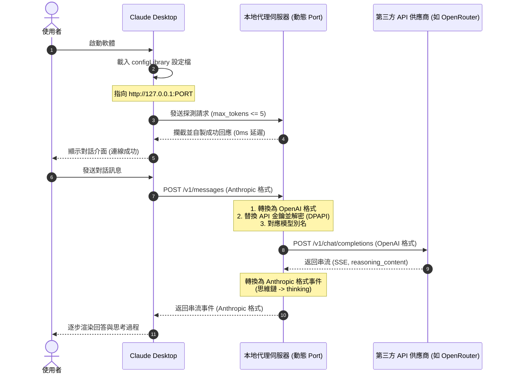

# Free Claude Launcher 🚀

**Free Claude Launcher** 是一個基於 Rust 與 Iced GUI 框架開發的 Windows 桌面輔助工具。它的核心目標是解除官方 **Claude Desktop (桌面版)** 的 API Gateway 限制，讓使用者能靈活且更划算地調用第三方 API 服務（如 OpenRouter、NVIDIA NIM、Anthropic 或其他自訂 API），從而「免費或以極低成本」體驗官方的 Claude 桌面應用。

---

## 為什麼需要 Free Claude Launcher？

官方的 Claude Desktop 預設只能使用 Anthropic 的官方 API 服務，這有兩個主要的痛點：

1. **付費成本高昂**：對部分開發者或日常使用者來說，長期購買官方 API 配額開銷較大。
2. **缺乏多模型/多管道支援**：無法接入其他出色的 API 供應商（例如 OpenRouter 提供的各種免費或廉價 API，或是 NVIDIA 提供的 NIM 免費體驗額度）。

本專案藉由修改配置與本機 Proxy 轉發，完美解決了這些限制。

---

## 工作原理 🛠️

本專案利用官方 Claude Desktop 支持 Gateway 模式的特性，透過修改本地配置並啟動本機 Proxy 伺服器來完成協定轉換。連線與轉發的完整流程如下：



本程式由 **GUI 配置器** 與 **背景本機 Proxy 伺服器** 兩部分組成：

1. **設定檔覆蓋機制**：
   程式會向 Windows 本機的 `%LOCALAPPDATA%\Claude-3p\configLibrary` 配置庫目錄中，寫入專屬的配置文件（包含 `_meta.json` 與自訂設定檔）。這能覆蓋 Claude 官方的 API 設定，使其在運行時將所有 API 請求（`v1/messages`、`v1/models` 等）重導向至本機代理伺服器 `http://127.0.0.1:<PORT>`。
2. **本機 Proxy 轉發與重寫**：
   當啟動 Claude 桌面版並開始對話時，Claude 發出的請求會先到達 Launcher 背景運行的 Proxy 服務。Proxy 會：
   - 根據使用者在 GUI 中的設定，替換對應認證與 API 供應商端點（如 `integrate.api.nvidia.com` 或 `openrouter.ai`）。
   - 自動解密並更換對應的 API Key 與驗證 scheme（`Bearer` 或 `x-api-key`）。
   - 將 Claude Desktop 特有的模型別名 (Model Aliases) 轉換為目標 API 所支持的實際模型名稱，確保對話能正常回傳。

---

## 主要功能特點 ✨

- 🌐 **多 API 供應商支援**：內建 OpenRouter、NVIDIA NIM、Anthropic 以及「完全自訂」供應商選項。
- 🤖 **模型別名對應 (Model Aliasing)**：自動處理模型清單對應，即使使用第三方的免費模型，也能讓 Claude Desktop 正常辨識並渲染。
- 🔄 **單實例自動喚醒**：當程式已在背景常駐時，再次雙擊捷徑不會重複開啟，而是會透過 HTTP (Port 3000) 自動通知舊進程重新彈出主視窗。
- 🛡️ **安全憑證加密**：使用 Windows DPAPI 加密機制將您的 API Key 安全地加密存儲於本機，確保隱私安全。
- ↩️ **一鍵還原官方**：提供「還原官方」功能，一鍵清除所有自訂配置，不干擾 Claude Desktop 原本的官方使用。
- 📐 **最佳化固定佈局**：固定的 `600x620` 視窗佈局，停用縮放以防高 DPI 螢幕下排版受擠壓。

---

## 使用與建置指南

### 專案程式目錄結構樹 📂

為了符合職責分離（SoC）並對齊 Python 專案的包結構，本專案將代碼拆分為以下現代化模組架構：

```text
src/
├── bin/                   # （目前為空目錄，預留給獨立工具程式使用）
├── conversion/            # 轉譯核心層（協定雙向轉換邏輯）
│   ├── request_converter.rs   # 處理 Request 轉譯（多模態、工具轉換、XML 清理）
│   └── response_converter.rs  # 處理 Response 轉譯（思考標籤、串流 usage、模型列表排序）
├── models/                # 資料模型層（強型態定義）
│   ├── claude.rs              # Anthropic Claude 請求/回應強型態資料結構
│   └── openai.rs              # OpenAI/Gateway 相關之模型資料結構
├── conversion.rs          # conversion 模組之 Rust 2018+ 入口宣告
├── models.rs              # models 模組之 Rust 2018+ 入口宣告
├── config.rs              # 本地設定檔 (launcher_settings.json) 的讀寫邏輯
├── crypto.rs              # 金鑰加密保護（基於 Windows DPAPI 原生安全解密）
├── launcher.rs            # 本機 Claude Desktop 路徑偵測、自動啟動與設定覆寫邏輯
├── server.rs              # 本地代理伺服器實作（接聽埠 3000，負責轉發與串流處理）
├── lib.rs                 # 函式庫進入點（定義扁平對外 API，並包含 10 個核心單元測試）
└── main.rs                # Windows GUI 視窗與系統托盤進入點
```

### 1. 建置成品

在終端機中執行以下命令來進行 Release 優化編譯：

```bat
cargo build --release
```

編譯後的執行檔位置：

```text
target\release\FreeClaudeLauncher.exe
```

### 2. 開發啟動

直接執行目錄下的批次檔：

```bat
run.bat
```

這會以 Release 模式自動編譯並執行您的 Launcher 程式。

### 3. 單元測試

若要執行內建的 Proxy 轉發與加密模組測試：

```bat
cargo test
```
