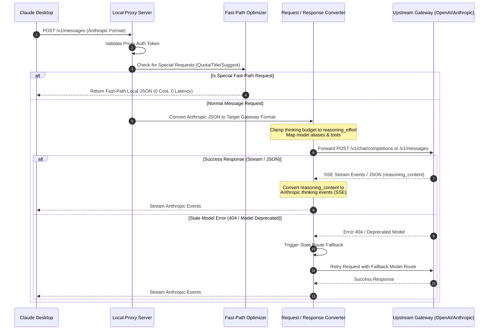

# FreeClaudeDesktop

**FreeClaudeDesktop** 是一款專為 [Claude Desktop](https://claude.ai/download) 設計的跨平台 (Windows, macOS, Linux) 桌面啟動器與本機 API Proxy。

它能將 Claude Desktop 的請求無縫轉接至 any OpenAI-compatible 或 Anthropic-compatible 上游 Gateway（如 One API, LiteLLM, DeepSeek, Ollama, vLLM 等）。

本專案受到 [Alishahryar1/free-claude-code](https://github.com/Alishahryar1/free-claude-code) 啟發，尤其是以本機 Proxy 串接多種模型供應商、模型層級路由及易用設定介面的方向。FreeClaudeDesktop 是專注於 Claude Desktop、原生桌面設定與隔離 Profile 管理的獨立 Rust 實作，並非 free-claude-code 的 fork。

[English](README.md) | **繁體中文**

---

## 📊 程式運行與架構流程圖

### 1. 🔄 系統整體運行與資料流架構 (System Architecture & Data Flow)


---

### 2. 🔌 API Proxy 請求與 Thinking / Reasoning 轉換流程 (API Proxy Flow)



---

## 🌟 核心特色

### 1. 🔌 本機 API Proxy (Local API proxy)

* 支援與 Claude Desktop 相容的 `/v1/messages` 和 `/v1/models` 端點。
* 實現 Anthropic Messages 與 OpenAI Chat Completions 協議間 Request、Response、工具呼叫及 SSE 串流的雙向轉換。
* 同時支援 OpenAI-compatible 與 Anthropic-compatible 的上游傳輸協議。
* 當上游 Gateway 回報模型更動時，自動重試已失效或棄用的模型路由。

### 2. 🗺️ 模型探索與路由 (Model discovery and routing)

* 自動從上游 `/v1/models` 探索模型並生成獨特的 Claude 相容別名。
* 保持 Claude Desktop 設定檔與已探索模型 ID 的同步。
* 在 GUI 提供個別模型顯示（Show）的切換開關。隱藏的模型會自設定檔、探索輸出與路由中移除，但仍保留於 Launcher 中以便日後重新啟用。
* 透過 `supports1m` 宣告 1M 上下文能力，不修改已探索模型 ID。
* 支援明確的預設（Fallback）、Opus、Sonnet 與 Haiku 模型路由覆寫。

### 3. 🧠 思考與推理適配 (Thinking and reasoning)

* 將 Claude 的 `thinking.budget_tokens` 轉換為上游的 `reasoning_effort` 分級。
* 自動讀取 LiteLLM 的 `model_info.supports_reasoning_effort` 與 `reasoning_effort_levels` 元數據。
* 支援設定個別模型的推理上限：`none`、`low`、`medium`、`high` 或 `max`。
* 將請求的推理預算限制在所選模型支援的最近分級。
* 將上游的 `reasoning_content` 轉換為 Claude 思考塊與串流事件。

> **已知行為 — 1M 上下文版本：**模型設定為支援 1M 上下文後，Claude Desktop 可能同時顯示一般 200K 與 1M 兩個版本。這是 Claude Desktop 對 `supports1m` 的呈現方式；FreeClaudeDesktop 仍維持單一且穩定的 discovery 模型 ID，並另外宣告 1M 能力。

### 4. ⚡ 本機最佳化 Fast-Path (Local optimization fast paths)

* 本機攔截並直回 Claude Desktop 的探測、配額檢查、標題生成、建議模式與檔案路徑提取請求，避免無效的上游 Token 消耗。
* 本機攔截 Web 工具，預設啟用 private-network 安全防護阻擋私有網路 Web Fetch 請求。

### 5. 🔒 憑證與隔離 Profile 運行 (Credential and profile isolation)

* 使用 platform 原生憑證庫（如 `keyring` / DPAPI）加密保護 API Key。
* 預設將 Proxy 伺服器僅綁定至本機迴路位址 `127.0.0.1`。
* 藉由獨立的鏡像 Profile 隔離運行 Claude Desktop，官方原版設定檔與登入狀態完全不受影響。
* 支援從官方原版 Profile 一鍵同步登入 Session 與自訂 MCP 伺服器配置。
* 支援重置鏡像 Profile 目錄而不影響官方原版資料。

### 6. 🌐 多語言介面支援 (Multilingual UI)

* 支援透過側邊欄底部的下拉清單在 **English** 與 **繁體中文** 之間自由切換。
* 免重新啟動應用程式即可即時更新所有介面文字與設定，並自動儲存偏好設定。

## 🔄 數據隔離與同步機制 (Mirror Profile & Sync)

本程式採用獨立 Profile 數據隔離機制，以確保官方原始資料的純淨性：

1. **首次啟動同步 (First-time Sync)**：
   * 當首次執行 FreeClaudeDesktop 時，程式會自動將當前平台官方原版目錄（如 `%APPDATA%\Claude`）中的登入 Session（Local Storage / IndexedDB）與自訂 MCP 伺服器配置複製至鏡像目錄中，免去重新登入帳號的麻煩。
2. **從原版同步 (Re-sync from Official)**：
   * 當您在官方原版 Claude 登入新帳號或新增了其他自訂 MCP 伺服器後，可一鍵點擊介面上的 **「從原版同步」**，程式會立即拉取原版最新狀態並重新套用代理設定。
3. **重置鏡像 Profile (Reset Mirror Profile)**：
   * 點擊 **「重置鏡像 Profile」** 僅會清空鏡像 Profile 並重新初始化，官方原版資料完全不受任何影響。

---

## 🔌 預設本機服務 (Default local services)

| 服務 | 預設位址 |
| FreeClaudeDesktop 本機代理 | `127.0.0.1:3000` |

---

## 📂 專案結構

```text
src/
├── core/          設定檔模型、常數與錯誤型別
├── platform/      跨平台路徑、API Key 保護、Claude Desktop 探測與設定寫入
├── runtime/       GUI 狀態管理、事件更新邏輯與系統托盤 (tray-icon) 整合
├── ui/            Iced 跨平台 UI 樣式與視窗元件
├── server/        Axum 本機 Proxy、Router、Models Endpoint 與 Streaming 處理
├── conversion/    Anthropic ⇄ OpenAI Request / Response 雙向轉換與模型路由重寫
├── optimization/  Claude Desktop 特殊請求 Fast-Path 與 Web 工具安全防護
├── models/        Claude 與 OpenAI / Gateway 內部資料結構
├── lib.rs         公開 API、設定套用流程與向後相容導出
└── main.rs        GUI 應用程式入口點
```

---

## 🛠️ 建置與測試

### 1. 執行單元測試

專案目前包含 103 個單元與整合測試：

```bash
cargo test
```

### 2. 建立 Release 版本

```bash
cargo build --release
```

### 3. 檢查編譯

```bash
cargo check
```

### 4. 建立 Debian／Ubuntu 安裝包

使用 [`cargo-deb`](https://docs.rs/crate/cargo-deb/latest)：

```bash
cargo install cargo-deb
cargo deb --locked
```

套件會安裝執行檔、desktop entry、256×256 應用程式圖示及兩份 README，產物位於 `target/debian/`。

### 5. 開發與直接運行

跨平台通用命令：

```bash
cargo run
```

---

## 🛡️ 安全注意事項

* **保護憑證**：請勿在 Log、錯誤訊息、測試資料或文件中寫入真實 API Key。
* **綁定邊界**：Proxy 預設僅綁定本機迴路地址 `127.0.0.1`。
* **私有網路防護**：`web_fetch` 預設不允許訪問 private network；若需開放，必須於 GUI 設定集中明確勾選啟用。
* **配置審查**：分發生成的 Claude Desktop 設定檔前請仔細審查，因為其中包含本機代理端點與身分驗證 Token。

---

## 🙏 致謝

感謝 [Alishahryar1/free-claude-code](https://github.com/Alishahryar1/free-claude-code)啟發了本專案。

## 📝 文件維護

模型 discovery、設定欄位、連接埠、安全邊界或測試數量變更時，請在同一份變更中同步更新 [README.md](README.md) 與 [README_zh.md](README_zh.md)。
