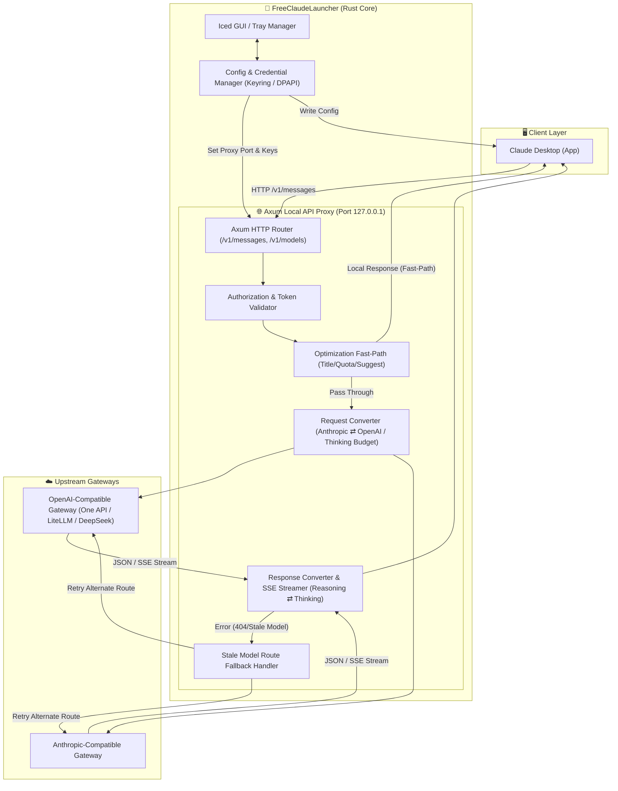

# FreeClaudeLauncher

**FreeClaudeLauncher** 是一款專為 [Claude Desktop](https://claude.ai/download) 設計的跨平台 (Windows, macOS, Linux) 桌面啟動器與本機 API Proxy。

它能將 Claude Desktop 的請求無縫轉接至任何 OpenAI-compatible 或 Anthropic-compatible 上游 Gateway（如 One API, LiteLLM, DeepSeek, Ollama, vLLM 等）。

本專案受到 [Alishahryar1/free-claude-code](https://github.com/Alishahryar1/free-claude-code) 啟發，尤其是以本機 Proxy 串接多種模型供應商、模型層級路由及易用設定介面的方向。FreeClaudeLauncher 是專注於 Claude Desktop、原生桌面設定與隔離 Profile 管理的獨立 Rust 實作，並非 free-claude-code 的 fork。

[English](README.md) | **繁體中文**

---

## 📊 程式運行與架構流程圖

### 1. 🔄 系統整體運行與資料流架構 (System Architecture & Data Flow)



---

### 2. 🔌 API Proxy 請求與 Thinking / Reasoning 轉換流程 (API Proxy Flow)

```mermaid
sequenceDiagram
    autonumber
    participant CD as Claude Desktop
    participant P as Local Proxy Server
    participant OPT as Fast-Path Optimizer
    participant CONV as Request / Response Converter
    participant GW as Upstream Gateway (OpenAI/Anthropic)

    CD->>P: POST /v1/messages (Anthropic Format)
    P->>P: Validate Proxy Auth Token
    P->>OPT: Check for Special Requests (Quota/Title/Suggest)
    
    alt Is Special Fast-Path Request
        OPT-->>CD: Return Fast-Path Local JSON (0 Cost, 0 Latency)
    else Normal Message Request
        P->>CONV: Convert Anthropic JSON to Target Gateway Format
        Note over CONV: Clamp thinking budget to reasoning_effort<br/>Map model aliases & tools
        CONV->>GW: Forward POST /v1/chat/completions or /v1/messages
        
        alt Success Response (Stream / JSON)
            GW-->>CONV: SSE Stream Events / JSON (reasoning_content)
            Note over CONV: Convert reasoning_content to<br/>Anthropic thinking events (SSE)
            CONV-->>CD: Stream Anthropic Events
        else Stale Model Error (404 / Model Deprecated)
            GW-->>CONV: Error 404 / Deprecated Model
            CONV->>CONV: Trigger Stale Route Fallback
            CONV->>GW: Retry Request with Fallback Model Route
            GW-->>CONV: Success Response
            CONV-->>CD: Stream Anthropic Events
        end
    end
```

---

## 🌟 核心特色

### 1. 🔌 高能本機 API Proxy (`/v1/messages` & `/v1/models`)

* **跨協議雙向轉換**：完整支援 Anthropic Messages 與 OpenAI Chat Completions 之 Request、Response 及 Streaming (SSE) 格式轉換。
* **Thinking / Reasoning 適配**：
  * 自動處理 DeepSeek R1 / OpenAI o1/o3 之 `reasoning_content` 與 Claude `thinking` (budget / effort clamp) 雙向事件轉換。
* **模型路由與失效自動重試 (Stale Model Route Fallback)**：
  * 當上游 Gateway 回報模型已下架或變更名稱時，系統會自動使用預備路由進行備用重試。
* **動態 Model Alias Rewrite**：
  * 自動根據 Gateway 提供的模型思考能力，將請求映射至正確的 Claude 模型別名。
* **模型探索與可見性控制**：
  * 從上游 `/v1/models` 建立 Claude Desktop 相容的模型清單，並可在 GUI 個別控制模型是否顯示。
  * 1M 上下文能力透過 `supports1m` 宣告，不修改 discovery 模型 ID；隱藏模型仍保留於 Launcher 清單，可隨時重新啟用。
* **Reasoning 能力覆寫**：
  * 讀取 LiteLLM `model_info.reasoning_effort_levels`，並允許在 GUI 個別設定 `none`、`low`、`medium`、`high` 或 `max` 上限。

> **已知行為 — 1M 上下文版本：**模型設定為支援 1M 上下文後，Claude Desktop 可能同時顯示一般 200K 與 1M 兩個版本。這是 Claude Desktop 對 `supports1m` 的呈現方式；FreeClaudeLauncher 仍維持單一且穩定的 discovery 模型 ID，並另外宣告 1M 能力。

### 2. ⚡ 本機 Fast-Path 最佳化

* **無效請求攔截**：對 Claude Desktop 的探測請求、標題產生、語意建議、Quota 檢測與檔案路徑提取等提供本機 Fast-Path 直回，節省無效上游 Token 費用。
* **Web Tools 安全邊界**：內建 private network 防護，預設阻擋私有網路 Web Fetch 請求。

### 3. 🔒 跨平台安全憑證儲存

* API Keys 使用系統原生憑證庫 (`keyring` / DPAPI) 加密保存。
* 可隨時寫入與還原 Claude Desktop `configLibrary` 設定。

### 4. 🛡️ 鏡像數據隔離與 Profile 隔離 (Mirror Profile)

* **官方原版數據 100% 唯讀保護**：絕不修改或破壞官方原版 `%APPDATA%\Claude` 的任何數據與登入狀態。
* **獨立隔離 Profile 運行**：藉由 Electron 原生 `--user-data-dir` 參數，將所有 3P 代理配置、自訂 MCP、`configLibrary` 與日誌完全隔離至 `%LOCALAPPDATA%\FreeClaudeLauncher\claude_profile`。
* **無縫無痕還原**：不經啟動器直接開啟官方原版 Claude Desktop 隨時均為 100% 純淨無修改的原生狀態。

---

## 🔄 數據隔離與同步機制 (Mirror Profile & Sync)

本程式採用獨立 Profile 數據隔離機制，以確保官方原始資料的純淨性：

1. **首次啟動同步 (First-time Sync)**：
   * 當首次執行 FreeClaudeLauncher 時，程式會自動將當前平台官方原版目錄（如 `%APPDATA%\Claude`）中的登入 Session（Local Storage / IndexedDB）與自訂 MCP 伺服器配置複製至鏡像目錄中，免去重新登入帳號的麻煩。
2. **從原版同步 (Re-sync from Official)**：
   * 當您在官方原版 Claude 登入新帳號或新增了其他自訂 MCP 伺服器後，可一鍵點擊介面上的 **「從原版同步」**，程式會立即拉取原版最新狀態並重新套用代理設定。
3. **重置鏡像 Profile (Reset Mirror Profile)**：
   * 點擊 **「重置鏡像 Profile」** 僅會清空鏡像 Profile 並重新初始化，官方原版資料完全不受任何影響。

---

## 📂 專案結構

```text
src/
├── core/          設定檔模型、常數與錯誤型別
├── platform/      跨平台路徑、API Key 保護、Claude Desktop 探測與設定寫入
├── runtime/       GUI 狀態管理、事件更新邏輯與系統托盤 (tray-icon) 整合
├── ui/            Iced 跨平台 UI 樣式與視窗元件
├── server/        Axum 本機 Proxy、Router、Models Endpoint 與 Streaming 處理
├── conversion/    Anthropic ⇄ OpenAI Request / Response 雙向轉換與模型路由重寫
├── optimization/  Claude Desktop 特殊請求 Fast-Path 與 Web 工具安全防護
├── models/        Claude 與 OpenAI / Gateway 內部資料結構
├── lib.rs         公開 API、設定套用流程與向後相容導出
└── main.rs        GUI 應用程式入口點
```

---

## 🛠️ 建置與測試

### 1. 執行單元測試

專案目前包含 103 個單元與整合測試：

```bash
cargo test
```

### 2. 建立 Release 版本

```bash
cargo build --release
```

### 3. 檢查編譯

```bash
cargo check
```

### 4. 建立 Debian／Ubuntu 安裝包

使用 [`cargo-deb`](https://docs.rs/crate/cargo-deb/latest)：

```bash
cargo install cargo-deb
cargo deb --locked
```

套件會安裝執行檔、desktop entry、256×256 應用程式圖示及兩份 README，產物位於 `target/debian/`。

### 5. 開發與直接運行

跨平台通用命令：

```bash
cargo run
```

---

## 🛡️ 安全注意事項

**保護憑證**：請勿在 Log、錯誤訊息、測試資料或文件中寫入真實 API Key。
**綁定邊界**：Proxy 預設僅綁定本機迴路地址 `127.0.0.1`。
**私有網路防護**：`web_fetch` 預設不允許訪問 private network；若需開放，必須於 GUI 設定集中明確勾選啟用。

---

## 📝 文件維護

模型 discovery、設定欄位、連接埠、安全邊界或測試數量變更時，請在同一份變更中同步更新 [README.md](README.md) 與 [README_zh.md](README_zh.md)。

---

## 🙏 致謝

感謝 [Alishahryar1/free-claude-code](https://github.com/Alishahryar1/free-claude-code) 展示如何透過單一、易於管理的本機 Proxy，將 Claude 相容客戶端連接到雲端與本機模型供應商。其供應商選擇、Opus／Sonnet／Haiku 分層路由、模型探索與管理介面的想法，啟發了本專案的發展方向。

FreeClaudeLauncher 將這些廣義概念應用在不同的產品邊界與獨立程式碼庫：以 Rust 建立 Claude Desktop 原生啟動器，提供 Anthropic／OpenAI 協議轉換、`configLibrary` 整合、系統憑證保護及鏡像 Profile 隔離。本專案未包含 free-claude-code 的原始碼。
