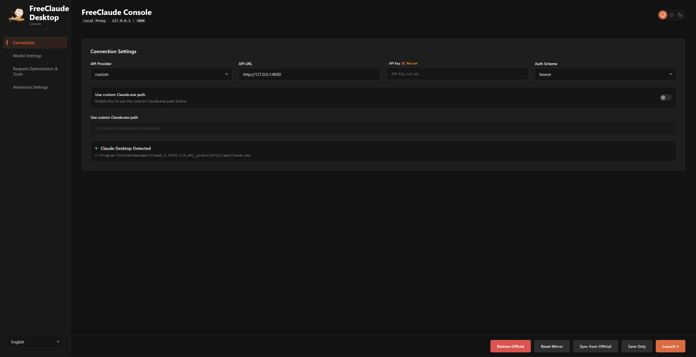
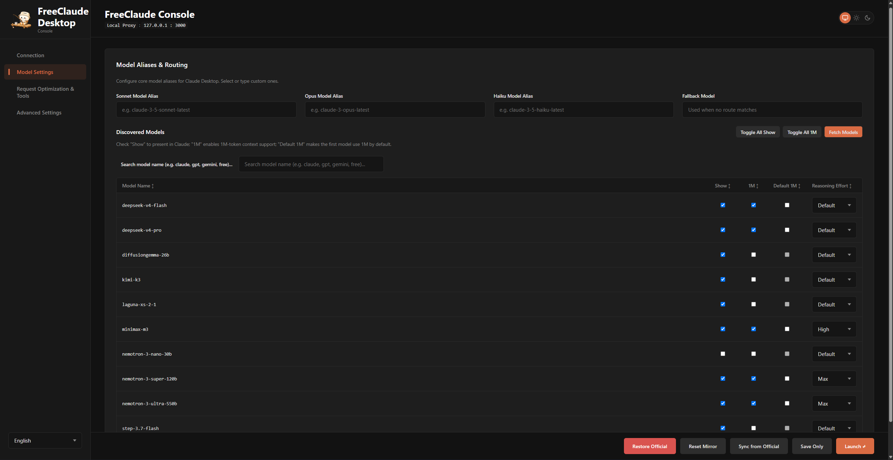
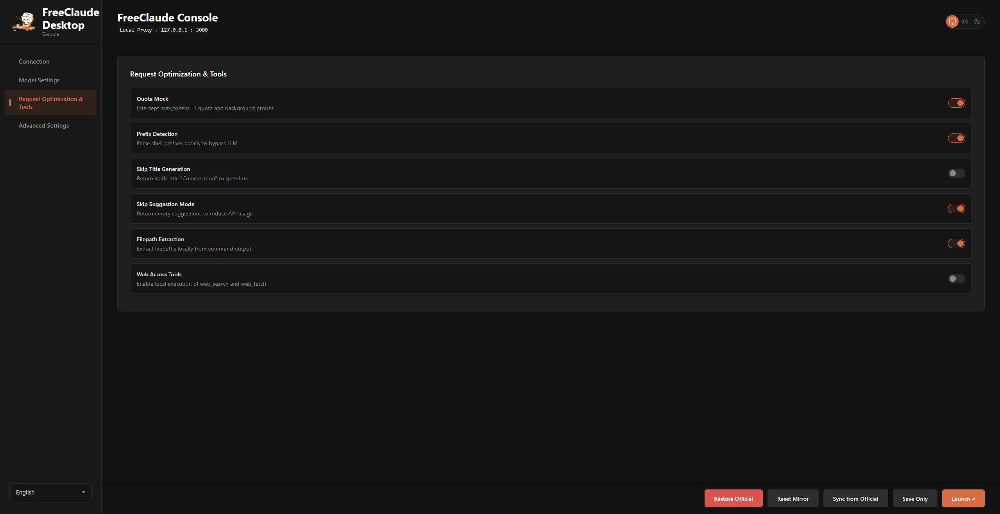
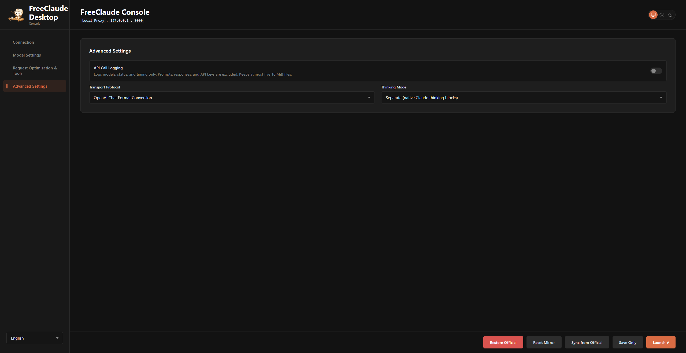

# FreeClaudeDesktop

<p align="center">
  
</p>

<!-- badge source: LICENSE (MIT) -->
[](LICENSE)
<!-- badge source: Cargo.toml (workspace.package.rust-version) -->
[](https://www.rust-lang.org/)
[](https://github.com/tokio-rs/axum)
[](https://tokio.rs/)

FreeClaudeDesktop 是跨平台的命令列啟動器與 Claude Desktop 本機 API Proxy。它讓 Claude Desktop 能連接 OpenAI 相容與 Anthropic 相容的 AI Gateway，同時將 Proxy 限制在本機 `127.0.0.1`。

> [English](README.md)

## 截圖預覽

> 點擊展開 — 4 個 Console 頁面預設收合，節省版面。

<details>
<summary><strong>Connection 連線設定</strong> — API Provider、Gateway URL、API Key 與 Claude 路徑偵測</summary>
<br>

<p align="center">
  
</p>

</details>

<details>
<summary><strong>Model Settings 模型設定</strong> — 別名路由（Sonnet / Opus / Haiku）與已探索模型清單</summary>
<br>

<p align="center">
  
</p>

</details>

<details>
<summary><strong>Request Optimization &amp; Tools 請求優化與工具</strong> — Quota Mock、前綴檢測、標題/建議跳過</summary>
<br>

<p align="center">
  
</p>

</details>

<details>
<summary><strong>Advanced Settings 進階設定</strong> — API 呼叫日誌、傳輸協定與思考模式</summary>
<br>

<p align="center">
  
</p>

</details>

## 目錄

- [截圖預覽](#截圖預覽)
- [關於專案](#關於專案)
- [功能](#功能)
- [快速開始](#快速開始)
- [安裝](#安裝)
- [設定](#設定)
- [CLI 參考](#cli-參考)
- [Proxy API](#proxy-api)
- [架構與專案結構](#架構與專案結構)
- [擴充與本地優化](#擴充與本地優化)
- [開發](#開發)
- [安全性](#安全性)
- [限制](#限制)
- [解除安裝](#解除安裝)
- [專案連結](#專案連結)
- [授權](#授權)

## 關於專案

Claude Desktop 使用 Anthropic Messages API。FreeClaudeDesktop 位於 Claude Desktop 與你選定的 Gateway 之間：

- 接收來自 Claude Desktop 的 Anthropic 請求（`/v1/messages`、`/v1/models`）。
- 轉換為 OpenAI Chat Completions 格式，轉送至已設定的 Gateway，並以 Anthropic SSE/JSON 串流回傳。
- 套用本地優化（配額探針攔截、標題/建議跳過、前綴檢測），讓常見的 UI 探針無需觸及 Gateway。

Proxy 是協定邊界。設定與密鑰保留在本機：非機敏設定存放於本地 settings store，API Key 存放於作業系統 keyring（`GET /settings` 與 Dashboard API 永遠不會回傳）。

更完整的流程請見 [docs/ARCHITECTURE.md](docs/ARCHITECTURE.md)。

## 功能

- **本機 Proxy `127.0.0.1:3000`** — 與 Claude Desktop 相容的端點，預設僅綁定 loopback。
- **Gateway 無關** — 支援 OpenAI 相容與 Anthropic 相容上游服務（`auto` / `bearer` / `x-api-key` / `sso` 驗證）。
- **完整模型探索** — 透過 `/v1/models` 抓取 Gateway 回傳的所有模型，正規化後發布至 Claude Desktop 模型選擇器，並可個別控制是否顯示。
- **模型路由與推理** — 將 `claude-opus-5[0]` / `claude-sonnet-4[0]` / `claude-haiku-4[0]` 等別名映射至真實 Gateway 模型；將 `thinking.budget_tokens` 轉譯為 `reasoning_effort`，並以原生 thinking 區塊或 `<antThinking>` 文字重播推理。
- **隔離的 Claude Desktop Profile** — 為 Proxy 環境建立獨立 Profile，並可從官方 Profile 重新同步選定資料。
- **跨平台** — Windows（Task Scheduler + Registry Run）、macOS（LaunchAgent）、Linux（systemd user service）；透過 npm optionalDependencies 支援 x64 與 ARM64。
- **宿主 Companion Daemon** — 維持 `/companion` WebSocket 供 Dashboard ↔ 宿主 RPC 使用。

## 快速開始

前置需求：[Claude Desktop](https://claude.ai/download) 與含 npm 的 Node.js。npm 會自動選擇符合作業系統與 CPU 架構的 binary 套件。

```bash
npm install -g @mushroomtw/freeclaudedesktop
freecd install
freecd dashboard
```

1. `freecd install` 會建立隔離 Profile、寫入已代理的 Claude Desktop 設定、啟動原生 Proxy，並預設啟用登入後自動啟動（加上 `--no-autostart` 可停用）。
2. `freecd dashboard` 會開啟同源的 Web 控制台 `http://127.0.0.1:3000/dashboard` — 在此設定 **Gateway URL**、**Auth Scheme** 與 **API Key**。`freecd start` 僅會啟動 Proxy。

驗證 Proxy 已啟動：

```bash
curl http://127.0.0.1:3000/healthz
# {"status":"ok"}  （回傳 JSON 因版本而異）
```

接著啟動 Claude Desktop — 模型選擇器將列出 Gateway 的模型（例如 `claude-opus-5[0]`）。

> [!TIP]
> 為獲得較完整的 Claude Desktop 體驗，建議上游模型支援多模態輸入，且上下文視窗至少為 200K tokens。僅支援文字或上下文較小的模型仍可運作，但圖片、長對話、檔案及大量工具呼叫等情境可能受限。

## 安裝

### 方式 A — npm（建議）

```bash
npm install -g @mushroomtw/freeclaudedesktop
freecd install                # 預設啟用自動啟動
freecd install --no-autostart # 不啟用自動啟動
```

套件：[`@mushroomtw/freeclaudedesktop@1.0.2`](packages/freeclaudedesktop/package.json) — 提供 `freecd` / `freeclaude` 指令與六個平台 optionalDependencies（`darwin-arm64/x64`、`linux-arm64/x64`、`win32-arm64/x64`）。

### 方式 B — 從原始碼建置

需要 [Rust 1.97.1 toolchain](https://www.rust-lang.org/tools/install)（`Cargo.toml` → `workspace.package.rust-version`）。

```bash
git clone https://github.com/mushroomTW/FreeClaudeDesktop.git
cd FreeClaudeDesktop
cargo build --release
# macOS / Linux
./target/release/freeclaude install
# Windows（PowerShell）
.\target\release\freeclaude.exe install
```

Cargo 建置的原生 CLI 名稱為 `freeclaude`；npm 套件則提供 `freecd` 入口。建置 workspace 所有 binary：

```bash
cargo build --release   # 建置 freeclaude (cli) + freeclaude-proxy
```

## 設定

所有設定皆透過 Web 控制台（`/dashboard` → `/settings` API）編輯。API Key 存放於 OS keyring，`GET /settings` 不會回傳。

### 環境變數

| 變數 | 用途 | 預設值 | 讀取位置 |
|---|---|---|---|
| `FREECLAUDE_PROXY_PORT` | Proxy 監聽連接埠 | `3000`（`core/src/core/constants.rs:DEFAULT_PORT`） | `cli/src/main.rs:proxy_port()`、`proxy/src/main.rs` |
| `FREECLAUDE_PROXY_URL` | `freecd status` 健康檢查使用的 URL | `http://127.0.0.1:{PORT}` | `cli/src/main.rs:print_proxy_status()` |

### Dashboard 設定（由 `core/src/core/config.rs` 持久化）

- **Gateway**：Base URL、auth scheme（`auto` / `bearer` / `x-api-key` / `sso`）、transport type、proxy auth token。
- **Models**：別名路由表（`real_model_routes`）、reasoning effort 路由、已探索模型、`supports1m` / `prefer1m` / 可見性覆寫、`reasoning_replay_mode`。
- **Optimizations**：quota mock、前綴檢測、標題/建議跳過、路徑提取、網頁工具、API 呼叫日誌等開關。
- **Desktop**：自訂 Claude 路徑、active port。
- **UI**：主題（`light`/`dark`）、語言。

## CLI 參考

執行 `freecd --help` 或 `freecd <command> --help` 查看完整說明。摘要（`cli/src/cli_args.rs`）：

```
freecd install [--no-autostart]
freecd start
freecd stop
freecd status
freecd configure              # 開啟 http://127.0.0.1:{port}/dashboard
freecd dashboard              # configure 的別名
freecd launch-claude
freecd restore                # 還原官方 Claude 設定
freecd purge --yes            # 清除應用程式資料（需加 --yes）
freecd update [--check]
freecd uninstall
freecd autostart enable|disable|status
```

常用流程：

```bash
freecd start
freecd status
freecd stop

freecd autostart enable
freecd autostart status
freecd autostart disable

# 僅檢查是否有新版 GitHub Release，不變更本機安裝
freecd update --check
```

`start` 會等待 `GET /healthz` 成功（最多約 5 秒）才回報完成。自動啟動後端：Windows Task Scheduler / Registry Run、macOS LaunchAgent、Linux systemd user service（`cli/src/runtime/autostart.rs`）。

## Proxy API

所有路由皆由 `http://127.0.0.1:{port}` 提供（`proxy/src/server/router.rs`）。CORS 僅允許同源 Dashboard 請求。

| 方法 | 路徑 | 說明 |
|---|---|---|
| `GET` | `/` | 根路徑 |
| `GET` | `/healthz` | 健康檢查 — `freecd start` 使用 |
| `GET` | `/dashboard` | Web 控制台 HTML |
| `GET` | `/dashboard.css` | 控制台樣式 |
| `GET` | `/dashboard.js` | 控制台腳本 |
| `GET` | `/assets/icon.png` | 應用程式圖示 |
| `GET` | `/settings` | 非機敏設定（不含 API Key） |
| `POST` | `/settings` | 更新設定 |
| `GET` | `/status` | 執行狀態 |
| `POST` | `/rpc` | Dashboard RPC → Companion Daemon（`GetStatus`、`DetectClaude`、`ApplySettings`、`FetchModels` …） |
| `GET` | `/companion` | WebSocket — 首個訊息需含 `requestId` |
| `POST` | `/v1/messages` | Anthropic Messages API（轉送至 Gateway） |
| `GET` | `/v1/models` | 正規化後的模型清單（Claude 別名） |

請求主體上限：`16 MiB`（`core/src/core/constants.rs:MAX_PROXY_BODY_BYTES`）。Gateway 逾時：`60 s`。

日誌寫入 `{local_app_data}/FreeClaudeDesktop/logs/` — `launcher.log`（每日輪替）與 `api-calls.log`（10 MiB + 4 個封存，`proxy/src/server/api_log.rs`）。可於 Dashboard 啟用 API 呼叫日誌。

## 架構與專案結構

```
FreeClaudeDesktop/
├── core/        # free-claude-core — schema、settings store、keyring、模型路由、轉換
├── proxy/       # freeclaude-proxy — Axum 路由、Gateway 轉送、SSE 轉換、Dashboard
├── cli/         # freeclaude — install / lifecycle / profile / autostart / companion 協調
├── packages/freeclaudedesktop/  # npm 包裝（bin/freecd）與平台 optionalDependencies
└── docs/        # 專案文件（ARCHITECTURE.md、EXTENSIONS_AND_SKILLS.md）
```

Crate 依賴方向：`proxy` → `core`、`cli` → `core`（+ `proxy` 的 server handle）。詳見 [docs/ARCHITECTURE.md](docs/ARCHITECTURE.md) 的 runtime 拓撲、訊息執行流程、模型探索/路由與狀態持有圖。

關鍵設計：

- **別名穩定性**：`claude-opus-5[0]` 等別名依模型清單位置穩定；`supports1m` / `prefer1m` 控制 1M 上下文變體，不改變 ID。
- **Companion Daemon**：CLI 會啟動宿主機上的 Companion Daemon 以維持 `/companion` WebSocket。

## 擴充與本地優化

詳見 [docs/EXTENSIONS_AND_SKILLS.md](docs/EXTENSIONS_AND_SKILLS.md)。Dashboard → Optimizations 可切換：

| 優化 | 說明 |
|---|---|
| **配額檢查攔截** | 攔截 `max_tokens=1` 的 quota 探針，本地直接回應 |
| **前綴檢測** | 常見 shell 前綴（`git`、`cargo`、`docker` …）本地解析，無需 LLM |
| **跳過標題生成** | 回傳固定 `"Conversation"`，跳過 LLM 標題總結 |
| **跳過建議提問** | 本地回傳空建議，跳過後續提問生成 |
| **路徑提取** | 以本地正則從命令輸出提取檔案路徑 |
| **網頁工具** | 本地執行 `web_search` / `web_fetch`（可設定允許的 scheme 與私有網路防護） |
| **API 呼叫日誌** | 啟用後以 JSON Lines 寫入 `api-calls.log` |

## 開發

工具鏈固定為 **Rust 1.97.1**（`Cargo.toml` 的 `rust-version`，於 `.github/workflows/ci.yml` 強制）。

```bash
cargo fmt --all -- --check
cargo clippy --workspace --all-targets --locked -- -D warnings
cargo test --workspace --locked
cargo check
```

CI 於 `ubuntu-latest`、`macos-15`、`windows-latest` 執行。

Release 針對六個 target（`x86_64`/`aarch64` × Linux/macOS/Windows）透過 `scripts/pack-platform.mjs` → `dist/npm/` 建置；以 `pnpm@10.15.0`（`package.json` 的 `packageManager`）發布。

本地 SonarQube 分析使用專案根目錄的 `sonar-project.properties`。

## 安全性

- Proxy 預設僅綁定 loopback。除非已規劃適當的驗證與網路控管，否則不要將其暴露至區域網路或公開網路。
- API Key 存放於 OS keyring（`keyring` crate），`GET /settings` 與 Dashboard API 永遠不會回傳。
- 散布前請檢視產生的 Claude Desktop 設定。
- `web_fetch` 可限制僅允許 `http`/`https` 並禁止存取私有網路（Dashboard → Web Fetch 設定），以緩解 SSRF 風險。
- 安全性問題請透過 [issue tracker](https://github.com/mushroomTW/FreeClaudeDesktop/issues) 回報 — 請勿張貼憑證。

> **免責聲明：**與 Anthropic 無任何關聯，亦未獲得其認可或支持。「Claude」和「Claude Desktop」均為其各自所有者的商標。此程式負責協調第三方模型；您需自行承擔 API／雲端服務的費用、憑證以及資料共享選擇。

## 限制

- 上游模型若不支援多模態或上下文較小，仍可運作，但圖片、長對話、檔案及大量工具呼叫等情境可能受限（見快速開始提示）。
- `reasoning_replay_mode` 與 `supports1m`/`prefer1m` 取決於 Gateway 透過 `/v1/models` 與 chat completions 暴露的能力。
- Linux 1M 上下文 runtime 修補嘗試另見 `docs/linux/claude-desktop-1m-runtime-patch-attempts.md`。
- Proxy 強制 `16 MiB` 請求主體上限與 `60 s` Gateway 逾時 — 僅能透過程式碼調整（`core/src/core/constants.rs`）。

## 解除安裝

移除 npm 套件前，請先清理本機狀態：

```bash
freecd uninstall
npm uninstall -g @mushroomtw/freeclaudedesktop
```

`uninstall` 會停止 Proxy 與 Companion Daemon、停用自動啟動、還原官方 Claude 設定並清除應用程式資料（`cli/src/main.rs:uninstall`）。

## 專案連結

- [架構](docs/ARCHITECTURE.md)
- [擴充與本地技能功能介紹](docs/EXTENSIONS_AND_SKILLS.md)
- [Issue tracker](https://github.com/mushroomTW/FreeClaudeDesktop/issues)

## 授權

FreeClaudeDesktop 採用 [MIT License](LICENSE)。
